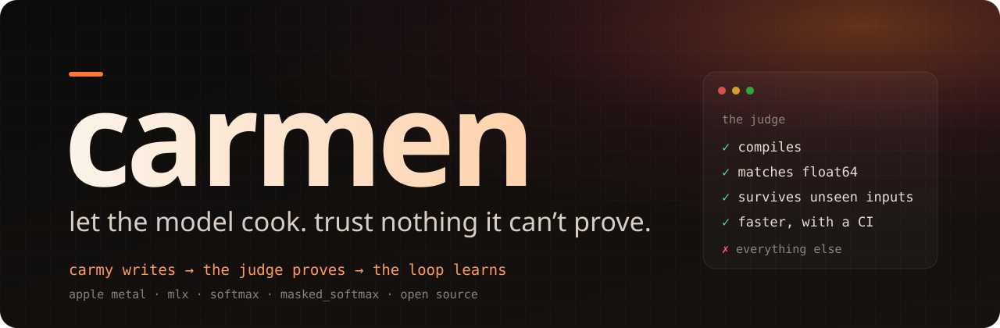
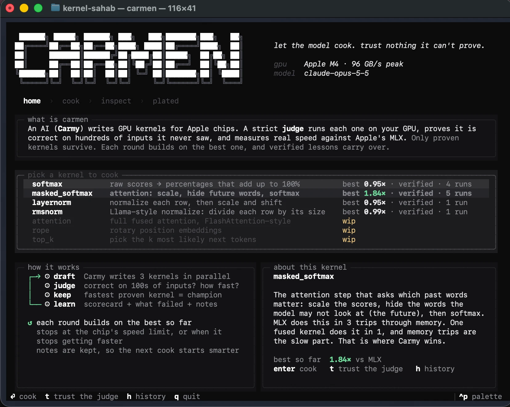
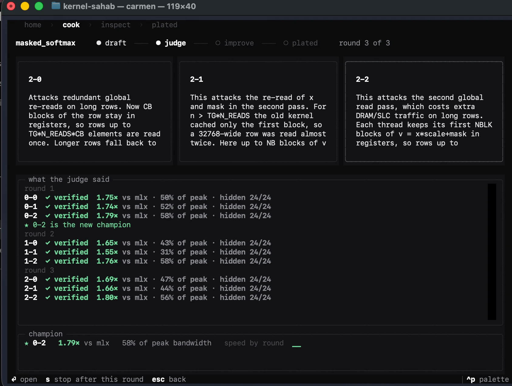

<p align="center">
  
</p>

<p align="center">
  <b>A self-improving harness where an LLM writes Apple Metal kernels and a judge it can't fool decides what's real.</b><br>
  <sub>Under 4k lines of Python. Apple Metal today; a new chip is one adapter file.</sub>
</p>

<p align="center">
  <a href="https://github.com/utsav1033/kernel-sahab/actions/workflows/tests.yml"></a>
</p>

## Results so far (Apple M4)

| kernel | what MLX does | vs MLX | vs `mx.compile` | sizes it never saw |
|---|---|---|---|---|
| **masked_softmax** | 3 kernels: scale, add mask, softmax | **1.82×** | **1.38×** | 1.72× |
| **add_rmsnorm** | 2 kernels: add, then rmsnorm | **1.41×** | **1.43×** | 1.47× |
| softmax | 1 hand-tuned kernel | 0.95× | | |
| layernorm | 1 hand-tuned kernel | 0.95× | | |
| rmsnorm | 1 hand-tuned kernel | 0.99× | | |
| matmul | 1 heavily tuned kernel (Apple's matrix units) | **0.93×** | 0.92× | 0.86× |
| attention | 1 heavily tuned fused kernel | 0.54× | 0.51× | 0.79× |

Fused rows are means of `carmen bench` (2 runs × 4 rounds × 3 drafts each, fresh memory). `mx.compile` is MLX's graph compiler: it merges element-wise steps but can't merge them into softmax or rmsnorm.

**What we found:**
- **LLM-written kernels don't beat hand-tuned code. They beat code nobody fused.** Ties where MLX has one tuned kernel, real wins where it runs several.
- **The first draft is most of the win, except on matmul.** On the row kernels, feedback rounds added 2–4% over round 1 and the loop beat blind best-of-N by 1–3%, inside run-to-run noise (about ±5%). On matmul, one round of feedback took the kernel from ~0.6× to 0.93× in two separate runs. On attention, the best kernel came in round 1 and feedback added nothing.
- **On hard kernels the model didn't make mistakes, it hit Apple's ceiling.** All 28 matmul and attention kernels that compiled were correct on visible and hidden inputs. Speed is where they fall short: 0.93× of MLX's matmul, 0.54× of its fused attention.
- **The judge caught real mistakes, and one of ours.** Of 96 bench kernels, 2 were wrong (an infinity mismatch, unwritten output) and 1 didn't compile; all were rejected. 12 more were rejected by an over-strict rule that banned `#pragma unroll`, a harmless speed hint. That rule is fixed: the judge has to be fair, not just strict.

**The judge is measured too:** 41 realistic bugs planted across softmax, add_rmsnorm, matmul and attention, run on an M4. A KernelBench-style check (one shape, `allclose`) passed **22 of them at 1e-2, and 12 even at the strict 1e-4**. carmen's judge caught **all 41**, and said where each one was. Two matmul bugs (wrong leading dimension, swapped tile axes) are exactly right on square matrices, so a one-shape square check can never see them.

| kernel | seeded bugs | carmen caught | one-shape check passed (1e-2) | one-shape check passed (1e-4) |
|---|---|---|---|---|
| softmax | 12 | **12** | 10 | 7 |
| add_rmsnorm | 11 | **11** | 5 | 1 |
| matmul | 8 | **8** | 4 | 2 |
| attention | 10 | **10** | 3 | 2 |

## Where AI-written kernels fail, and how carmen catches each one

Every row is a failure mode documented in the papers below or seen in practice. The judge is built against this list.

| failure mode | seen in | carmen | how |
|---|---|---|---|
| tail and boundary bugs (odd lengths, the last element) | [Measuring the Checker](https://arxiv.org/abs/2609.22220) | ✅ | lengths 1, 2, 3, 7, 31, 33, 255, 257, 1025, 4097, 70001; a failure is shrunk to the smallest input that still fails |
| precision: fp16 accumulation, overflow in `exp` or `x²` | [Measuring the Checker](https://arxiv.org/abs/2609.22220) | ✅ | float64 answer key, values up to ±10⁴, tolerance relative to each row's scale |
| race conditions (missing barriers) | [Measuring the Checker](https://arxiv.org/abs/2609.22220) | ⚠️ partly | the 4 largest inputs of different kinds and dtypes run 5× and must match byte for byte; a race that never fires on this GPU can still slip through |
| indexing: wrong strides, overlapping rows | [Measuring the Checker](https://arxiv.org/abs/2609.22220) | ✅ | many rows, full-output comparison, located by row and column |
| semantics: NaN, −inf, fully masked rows, eps | [Test-Input Generation for Tensor Programs](https://arxiv.org/abs/2606.27396) | ✅ | trap inputs per kernel: all −inf rows, zero-variance rows, eps-dominated rows, cancelling residuals |
| fast only on the shapes or config it was tested on | [Gaming Without an Attacker](https://arxiv.org/abs/2608.08722), [KernelBench-Verified](https://github.com/facebookresearch/kernel_bench_verified) | ✅ | every config is checked; each round draws secret sizes and data the model never sees, for correctness and speed |
| an output that is never written still passes | [KernelBench #165](https://github.com/ScalingIntelligence/KernelBench) | ✅ | the output is pre-filled with NaN; errors are relative to each row, so all-zeros fails |
| writing past the end of the output | seen in practice | ✅ | a guard zone after the output must stay untouched |
| skipping work or gaming the timer | [Reward Hacking in Self-Improving Code Agents](https://openreview.net/forum?id=ikrQWGgxYg), [Auditing Harness Tampering](https://arxiv.org/abs/2609.00069) | ✅ | the model only returns kernel text; it never runs code in the judge; speeds beyond measured memory bandwidth are flagged |
| a launch grid smaller than the work, silently truncated | [MLX #4534](https://github.com/ml-explore/mlx/issues/4534) | ✅ by design | the harness sets the launch shape, never the model |
| bf16, the dtype most models ship in | seen in practice | ✅ | bf16 cases in the visible battery, the fresh fuzz and the hidden draw |
| empty tensors | seen in practice | ✅ by design | the harness never launches on an empty tensor |
| a slow baseline making a kernel look fast | [KernelBench-Verified](https://github.com/facebookresearch/kernel_bench_verified) | ✅ | every speedup is reported against plain MLX **and** `mx.compile` |
| attention: causal boundary off by one, a missing KV-cache offset, the softmax rescale | seen in practice | ✅ new | queries ≠ keys, head sizes 1 to 160, scores in the hundreds, values that ramp with the key index; 10 seeded bugs |
| 32-bit index overflow on tensors over 2³¹ elements | seen in practice | ❌ | needs 8+ GB buffers per test; out of reach on most Macs |
| non-contiguous or strided inputs | seen in practice | ❌ | inputs are always contiguous rows today |
| matmul-style bugs: 2D tile edges, the K tail, indexing that's only right on square matrices | [Measuring the Checker](https://arxiv.org/abs/2609.22220) | ✅ new | non-square shapes on every tile edge, K from 1 to 4097, 8 seeded matmul bugs, all killed on an M4 |

<p align="center"></p>

New to kernels? [**How it all works**](docs/how-it-works.md) explains LLMs, GPUs, kernels and carmen from scratch.

## Install

On an Apple Silicon Mac, with [uv](https://docs.astral.sh/uv/):

```bash
uv tool install "carmen[metal] @ git+https://github.com/utsav1033/kernel-sahab"
export ANTHROPIC_API_KEY=...        # or put it in a .env file where you run carmen
carmen                              # the app
```

No uv? `pipx install "carmen[metal] @ git+https://github.com/utsav1033/kernel-sahab"` does the same.

---

LLMs write GPU kernels that look fast. A lot of them are quietly wrong.

- A KernelBench-style check (one shape, `allclose` at 1e-2) **misses 16.9% of injected kernel bugs, and 78.6% of precision bugs** ([Measuring the Checker](https://arxiv.org/abs/2609.22220)).
- Standard eval said **1.43×**. Hidden inputs said **0.88×** ([KernelBench-Verified](https://github.com/facebookresearch/kernel_bench_verified)).
- On Apple Metal, **30% of LLM "wins" failed on a config the model hadn't seen**, with nobody prompting it to cheat ([Gaming Without an Attacker](https://arxiv.org/abs/2608.08722)).
- An all-zeros softmax **passes** KernelBench's check once rows get long ([issue #165](https://github.com/ScalingIntelligence/KernelBench)).

Generation is cheap now. **Trust is the bottleneck.** carmen is built around that.

## The idea

> The model is the intelligence. The judge is the truth. Correction is the loop between them,
> and memory is that loop's verified residue.

- **Carmy** (the model) writes the kernel. It's trusted to be smart and **never trusted to grade**. It has no tools; it can only return kernel text.
- **The judge** is plain, deterministic Python. It knows what the op *means* (a float64 answer key, properties every correct answer has, where bugs hide), runs the kernel on the real GPU, and says **where** it's wrong, not just *that* it's wrong.
- **The loop** gets from *correct* to *fast*: three Carmy drafts in parallel, the judge ranks them, the best becomes the champion, and each round attacks one bottleneck. Carmy sees the whole per-shape scorecard (a win on one shape that loses the others is thrown away) and a ledger of every idea already tried and how it scored, so rounds build on each other instead of repeating. Lessons are written only after a round that proved something. It stops near the chip's measured memory bandwidth, the physical ceiling.
- **Memory** keeps only what the judge proved. Lessons are credited by verdicts, never by the model saying "that worked".

<p align="center"></p>


## From source

On an Apple Silicon Mac:

```bash
git clone https://github.com/utsav1033/kernel-sahab && cd kernel-sahab
pip install -e '.[metal,dev]'
cp .env.example .env               # put your ANTHROPIC_API_KEY in it

carmen peak                          # measure your GPU's real memory bandwidth (cached)
carmen broken softmax                # prove the judge works: it must kill every seeded bug
carmen judge softmax kernels/golden/softmax.metal --hidden
carmen run masked_softmax            # let Carmy cook
carmen report runs/<id>
```

**Keys and settings** live in `.env` (gitignored; see `.env.example`). carmen loads it on every command, and anything you `export` in your shell overrides it. Use `--env path/to/file` to load a different file.

**Using an Anthropic-compatible proxy?** Set `ANTHROPIC_BASE_URL` next to your key in `.env`. carmen then sends plain Messages API requests (no Anthropic-only extras) and never prints the URL. If the proxy strips structured outputs, add `CARMEN_STRUCTURED=0`.

### The app

Run **`carmen`** with no arguments. It follows one path:

1. **Home:** what carmen is in three lines, the kernels you can cook (with their best verified result), the self-improving loop drawn out, and a plain-English note on the highlighted kernel. Work-in-progress kernels are listed but greyed out.
2. **Kitchen:** watch it cook live. A stage rail (draft → judge → improve → plated), three draft cards that go *writing → judging → ✓ verified 1.31× / ✗ tail bug at n=33*, what the judge said, and the champion with its speed by round. `s` stops after the current round.
3. **Inspect:** open any card for the code beside its verdict: speed per shape, % of peak, hidden results, and exactly what Carmy was told. `d` diffs it against the champion, `i` improves from it, `e` exports the `.metal`.
4. **Plated:** the result. Best kernel, speed vs MLX on seen and unseen sizes, and how many wrong kernels a naive check would have passed.

`t` on the home screen shows the judge catching seeded bugs live; `h` opens history.

### Commands

| command | what it does |
|---|---|
| `carmen` / `carmen ui` | the terminal app |
| `carmen ops` | list the ops the judge knows |
| `carmen peak` | copy-kernel bandwidth, used as the roofline for every speed claim |
| `carmen judge <op> <file>` | judge a kernel you wrote; `--tg 128 --tg 256` sweeps threadgroup sizes, `--hidden` adds a secret draw |
| `carmen broken <op>` | run 10-12 seeded broken kernels (per op) through the judge *and* through a KernelBench-style check, side by side |
| `carmen run <op>` | the self-correcting loop; `--mode bon` runs the best-of-N control arm at the same budget |
| `carmen bench [ops]` | loop vs best-of-N on the same budget, repeated, one table (`bench.md`) ready to paste here |
| `carmen profile [model]` | load a real model with mlx-lm (default Qwen2.5-0.5B 4-bit), measure prefill and decode tok/s, and time every step of a layer at its real shapes, so you know which kernels are worth writing (`pip install 'carmen[models]'`) |
| `carmen report <run>` | the numbers below, for one run |
| `carmen playbook` | what Carmy has learned, and how much each lesson is worth |

## How the judge decides

Every candidate runs in its own process with a timeout, because a bad kernel can hang the GPU. Checks fail fast, in order:

| gate | catches |
|---|---|
| **static** | oversized source, `#include`/`asm`, illegal launch configs |
| **compile** | the Metal compiler's own errors, sent back verbatim |
| **no-tolerance checks** | outputs pre-filled with NaN, so an unwritten element can't hide; NaN/±inf positions must match the reference; 5 identical runs must be byte-identical (races); a sentinel pad catches writes past the end; rows must sum to 1 |
| **visible battery** | tail lengths (1, 2, 3, 7, 31, 33, 255, 257, 1025, 4097, 70001), ±1e4 values (overflow without max-subtraction), very negative rows, constant rows, −inf masks, fully masked rows, spikes in the last element, fp32 and fp16 |
| **fresh fuzz** | new random off-grid shapes every round; failures join a permanent regression corpus |
| **hidden draw** | secret-seeded sizes off the power-of-two grid and different data statistics, for **correctness and speed**. It's reported, never shown to Carmy, and never used to pick the winner |
| **timing** | only after everything passes: interleaved A/B against the stock MLX op, median, bootstrap 95% CI, % of measured peak bandwidth |

**Tolerance** is fixed in advance, not tuned per kernel: output rounding plus float32 accumulation error (`2·eps + 8·eps₃₂·√n`), measured **relative to each row's scale**, so all-zeros can't sneak through. The stock library's own error can loosen it, but only up to a hard 16× cap. Any test input the stock library itself can't pass is dropped as unfair, and the count is logged.

**Feedback is built for the model.** Not "failed", but where and how. Here's real judge output for a kernel whose outputs are rounded through fp16. A KernelBench-style check passes it:

```
[TG=256] FAILED 20 test(s). First: neg_inf_mask[45x4938, float32] -> values outside tolerance,
in 0.7% of elements, scattered across 44 of 45 rows. Max row-relative error 0.000390824,
allowed 6.7254e-05. At row 0, column 11: got 0.00128269, expected 0.00128309.
Smallest failing input of this kind: rows=1, n=2.
```

And for one that forgets the last element of each row:

```
[TG=256] FAILED 42 test(s). First: neg_inf_mask[45x4938, float32] -> NaN where a number was
expected (unwritten output, or overflow), in only the last elements of rows (columns >= 4937
of 4938): tail handling. At row 0, column 4937: got nan, expected 0.
```

**The judge is measured too.** `carmen broken` runs 12 seeded bugs (10 for the norms) across five fault families (boundary, precision, sync, indexing, semantic; see [Du et al.](https://arxiv.org/abs/2609.22220)), and reports how many carmen kills and how many a KernelBench-style check would have let through.

## Philosophy

1. **The generator is powerful and untrusted. The judge is simple and trusted.** Intelligence goes into generating, never into grading.
2. **The judge encodes what the op *means*,** not a list of tests. That part doesn't depend on the chip. Only compile/run/time does.
3. **Test where bugs live, somewhere the model can't predict:** edges, extremes, special values, and data drawn fresh every round.
4. **Self-correction is an external verdict plus a located error.** Models fix bugs well once told *where* they are.
5. **Measure the measurer.** A judge without a measured blind-spot rate is just a claim.
6. **Remember only verified causes.** When in doubt, forget.
7. **Start as a loop and a judge.** Every extra part has to earn its place against a failure seen in a real run.
8. **Report mechanisms honestly,** including when the harness fails. A verified 1.0× is a result. An unverified 3× isn't.

## What carmen reports

For every run (`carmen report`), from judge verdicts alone:

- **first-round verified**: how often Carmy is right on the first try (tests the premise that models are good)
- **naive check fooled**: kernels a KernelBench-style check accepts that carmen proves wrong
- **hidden tests clean**: verified kernels that also pass inputs they never saw
- **speedup vs MLX**, with a CI, on visible *and* hidden sizes, plus worst-case % of peak bandwidth
- **loop vs best-of-N**: run the same op with `--mode bon` at the same call budget to see whether feedback and memory earn their keep

## Adding an op or a chip

An **op** is one file in `carmen/ops/`: a float64 `reference`, `invariants`, input `generators`, a visible battery, and the kinds used for fuzz and hidden draws. The judge, the loop and Carmy don't change. Layernorm is next.

A **chip** is one file in `carmen/backends/`: `build`, `upload`, `run`, `launch`, `baseline`, `measure_peak_gbps`. `metal.py` is ~110 lines. CUDA/ROCm is a sibling file, not a new test suite.

```
carmen/
  tui.py        the terminal app (Textual): browse, judge, improve, cook
  ops/          what each op means: reference, invariants, generators (chip-independent)
  backends/     how to compile, run and time on a chip (metal.py is the only Metal-aware file)
  judge/        gates, tolerance, diagnosis, timing stats; worker.py is the GPU-side process
  carmy.py      the model: stateless calls, structured output, no tools
  loop.py       draft → verify → improve → stop at the roofline
  memory.py     the playbook: verdict-credited lessons, chip vs op
  broken.py     seeded bugs for measuring the judge
kernels/golden/ hand-checked reference kernels (the judge's positive control)
tests/          the judge's logic, tested on a numpy stand-in for the GPU
```

## Status

- ✅ The judge, loop, memory, CLI and app are tested (`pytest`, 53 tests, run on every push) against a numpy stand-in for the GPU, including the judge catching kernels a KernelBench-style check passes.
- ✅ On a real M4: the judge killed 12/12 seeded broken softmax kernels and 11/11 add_rmsnorm ones; every verified kernel so far is clean on hidden inputs.
- ✅ Every speedup is reported twice: against plain MLX, and against `mx.compile` (MLX's graph compiler, which fuses element-wise ops). The second is the strongest baseline a user gets without writing Metal.
- ⚠️ The improve rounds have not yet clearly beaten round 1 on real hardware. `carmen bench` measures that directly (loop vs best-of-N, same budget).
- 🆕 matmul: a 2-D tiled launch, K-tail and square-only bugs, 8 seeded mutants. Golden kernel verified on an M4; 8/8 seeded bugs killed.
- 🆕 attention: fused causal attention for one head, raced against MLX's `scaled_dot_product_attention`. Two runs on an M4: all 12 kernels correct (online softmax, simdgroup matrix units), best 0.54× of MLX. The judge's own test found a hole in the judge: `no_max_subtraction` survived because the "large score" inputs peaked at 53, and `exp` only overflows above 88.7, so the bug changed nothing. The trap now produces scores in the hundreds, with a test that it really overflows.
- 🔜 rope (wip), top-k (wip).

## Built on the shoulders of

[Measuring the Checker](https://arxiv.org/abs/2609.22220) · [Gaming Without an Attacker](https://arxiv.org/abs/2608.08722) · [Metal-Sci](https://arxiv.org/abs/2605.09708) · [Hacker-Fixer Loops](https://arxiv.org/abs/2606.08960) · [Test-Input Generation for Tensor Programs](https://arxiv.org/abs/2606.27396) · [Reward Hacking in Self-Improving Code Agents](https://openreview.net/forum?id=ikrQWGgxYg) · [Meta-Harness](https://arxiv.org/abs/2603.28052) · [Auditing Harness Tampering](https://arxiv.org/abs/2609.00069) · [SAGE](https://arxiv.org/abs/2609.35568) · [Prime Agent](https://arxiv.org/abs/2608.23552) · [KernelBench-Verified](https://github.com/facebookresearch/kernel_bench_verified) · [Contract-Grade Verifier](https://github.com/RishiShah99/lethe) · [Building a C compiler with parallel Claudes](https://www.anthropic.com/engineering/building-c-compiler)

<sub>Named after Carmen "Carmy" Berzatto. Yes, chef. Banner set in Space Grotesk and JetBrains Mono (SIL Open Font License).</sub>
