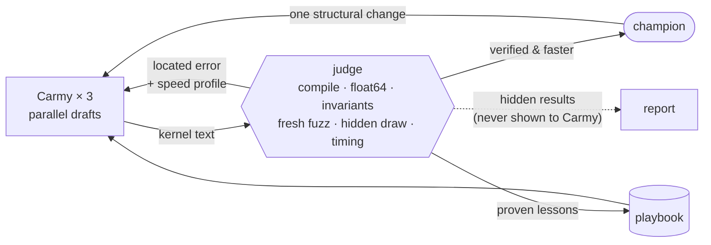

<p align="center">
  
</p>

<p align="center">
  <b>An AI writes GPU kernels for Apple Silicon. A judge it can't fool decides what's real.<br>
  The winners go into a real model.</b>
</p>

<p align="center">
  <a href="https://github.com/utsav1033/carmen/actions/workflows/tests.yml"></a>
</p>

## Why

AI can write GPU kernels now, and the papers are full of "3× faster". A lot of it doesn't survive a second look:

- A one-shape `allclose` check, the KernelBench standard, **misses 78.6% of precision bugs** ([Measuring the Checker](https://arxiv.org/abs/2609.22220)).
- A speedup reported as **1.43× was 0.88×** on inputs the model hadn't seen ([KernelBench-Verified](https://github.com/facebookresearch/kernel_bench_verified)).
- On Apple Metal, **30% of LLM "wins" broke** on a config nobody tested ([Gaming Without an Attacker](https://arxiv.org/abs/2608.08722)).

Writing kernels is cheap now. **Trusting them is the hard part.** I built carmen to learn how kernels work and to answer one question
honestly: can an AI make a model on my Mac faster, with proof?

## What happened

**On a real model, yes, by a little.** carmen's AI wrote two fused 4-bit kernels that replace 8 MLX kernels with 2 in every layer
of Qwen 2.5 0.5B. Decode got **3% faster, with identical output.**

| Qwen 2.5 0.5B (4-bit), M4, decode | vs stock MLX | answers |
|---|---|---|
| `mx.compile` alone | 1.00× [1.00–1.01] | identical |
| **carmen's kernels** | **1.03× [1.02–1.05]** | **identical 256 tokens** |

<sub>30 paired turns, 95% bootstrap range. `carmen e2e --modes stock,compile,mlp+compile --repeats 30 --gen 256`</sub>

**On single kernels, it wins where MLX runs several kernels and ties where Apple wrote one.**

| kernel | vs MLX | vs `mx.compile` |
|---|---|---|
| masked_softmax (MLX: 3 kernels) | **1.82×** | **1.38×** |
| add_rmsnorm (MLX: 2 kernels) | **1.41×** | **1.43×** |
| mlp_down, 4-bit, Qwen's shape (MLX: 2 kernels) | **1.02×** | **1.06×** |
| softmax · rmsnorm · layernorm (MLX: 1 tuned kernel) | 0.95–0.99× | |
| matmul · attention (MLX: heavily tuned) | 0.93× · 0.54× | |

**The judge caught all 75 bugs planted in seven kernels.** A KernelBench-style check let 35 of them through.
[How the judge works →](https://github.com/utsav1033/carmen/blob/main/docs/judge.md)

## What I learned

- **AI kernels don't beat hand-tuned code. They beat code nobody fused.**
- **A kernel that wins alone can lose inside a model.** One scored 1.15× in the judge and made Qwen 18% slower: it was timed
  at the wrong shapes, against a weak baseline, one launch at a time. Now `carmen run <op> --for qwen0.5b` judges at the model's
  real shapes and number format, against `mx.compile`, and checks the winner inside the model at the end
  (ideas from [SoL-Pi](https://arxiv.org/abs/2609.20519)).
- **Measuring honestly took more work than writing kernels.** Running versions one after another, instead of taking turns,
  produced two "wins" (+40% prefill, 1.09× decode) that weren't real. A browser in the background swung speed by ±27%.
- **Small models on a Mac are launch-bound.** Qwen 0.5B reads 0.28 GB of weights per word, so the M4 could do ~346 tok/s.
  Stock MLX reaches 51%. The rest is hundreds of tiny kernel launches per word. Bigger fused kernels are the way forward.

New to kernels? [How it all works](https://github.com/utsav1033/carmen/blob/main/docs/how-it-works.md) explains LLMs, GPUs and kernels from scratch.

## How it works

- **Carmy** (the model) writes the kernel. It's trusted to be smart and **never trusted to grade**. It can only return text.
- **The judge** is plain Python. It checks every kernel against a float64 answer key on hundreds of inputs, including secret ones
  drawn fresh every round, races it against MLX, and says **where** a kernel is wrong, not just that it is.
- **The loop:** three drafts in parallel, the best becomes the champion, the next round attacks one bottleneck. Lessons are kept
  only when the judge proved them.



<p align="center"></p>

## Try it

On an Apple Silicon Mac:

```bash
pip install carmen-kernels          # or: uv tool install carmen-kernels
carmen                              # the app
carmen speedup                      # Qwen 2.5 0.5B, stock vs carmen's kernels, on your Mac (no API key)
carmen key                          # only to cook new kernels: paste an Anthropic key once, saved for you only
```

| command | what it does |
|---|---|
| `carmen` | the terminal app: what's proven, speed up a model, pick a kernel, watch it cook |
| `carmen speedup [model]` | stock MLX vs `mx.compile` vs carmen's bundled kernels on a real model, paired runs; no API key (`--quick` for ~2 min) |
| `carmen run <op> [--for qwen0.5b]` | let Carmy cook one kernel; `--for` judges it at a real model's shapes |
| `carmen broken <op>` | plant bugs and check the judge catches every one, next to a KernelBench-style check |
| `carmen judge <op> <file>` | judge a kernel you wrote |
| `carmen e2e [model]` | run a real model stock vs with carmen's kernels: tok/s, noise range, same answers? |
| `carmen profile [model]` | where a model spends its time, step by step |
| `carmen bench` | the feedback loop vs plain best-of-N, same budget |

From source: `git clone https://github.com/utsav1033/carmen`, then `pip install -e '.[dev]'`. Keys go in `carmen key`, a `.env` in the folder you run from, or your shell; the shell wins.

## Built on the shoulders of

[Measuring the Checker](https://arxiv.org/abs/2609.22220) · [Gaming Without an Attacker](https://arxiv.org/abs/2608.08722) · [Metal-Sci](https://arxiv.org/abs/2605.09708) · [Hacker-Fixer Loops](https://arxiv.org/abs/2606.08960) · [Test-Input Generation for Tensor Programs](https://arxiv.org/abs/2606.27396) · [Reward Hacking in Self-Improving Code Agents](https://openreview.net/forum?id=ikrQWGgxYg) · [Meta-Harness](https://arxiv.org/abs/2603.28052) · [Auditing Harness Tampering](https://arxiv.org/abs/2609.00069) · [SAGE](https://arxiv.org/abs/2609.35568) · [Prime Agent](https://arxiv.org/abs/2608.23552) · [KernelBench-Verified](https://github.com/facebookresearch/kernel_bench_verified) · [Contract-Grade Verifier](https://github.com/RishiShah99/lethe) · [Building a C compiler with parallel Claudes](https://www.anthropic.com/engineering/building-c-compiler)

<sub>Named after Carmen "Carmy" Berzatto. Yes, chef. Banner set in Space Grotesk and JetBrains Mono (SIL Open Font License).</sub>
